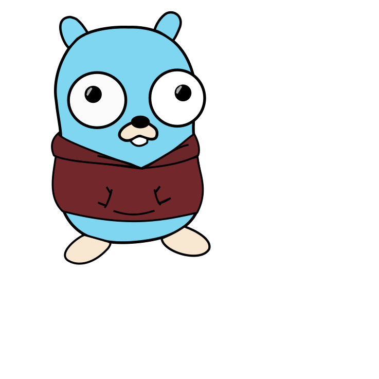

# Shelfie
## A CLI Tool to manage your personal bookshelf

I'm building shelfie to expand my knowledge of go.

Here's a quick list of the knowledge demonstrated in the project:
- Pointers
- Nested Structs
- Methods
- Json Marshal & Unmarshal
- File System operations
- Command Line Flags

